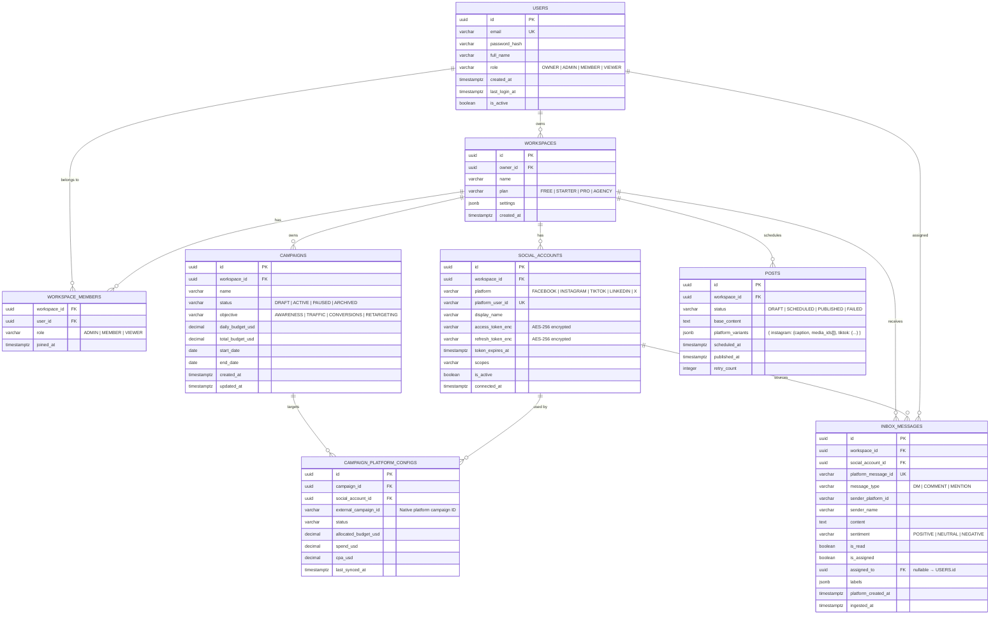
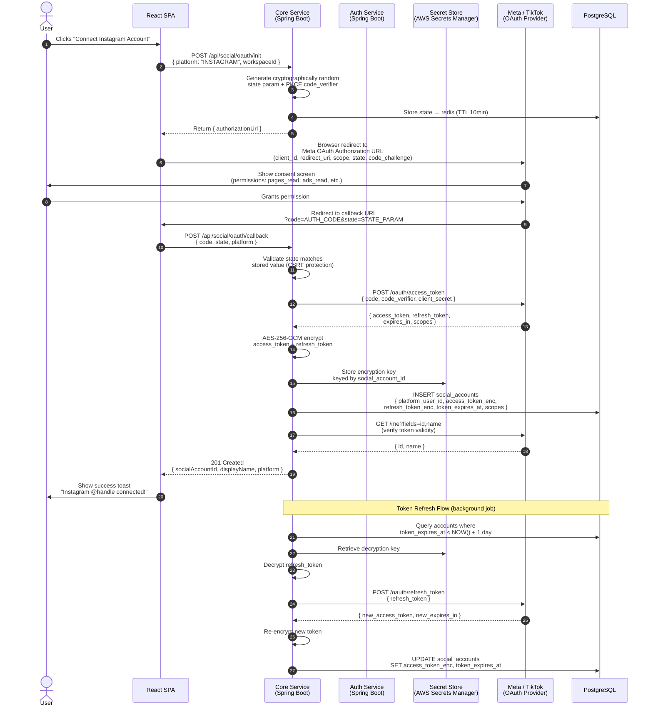

# Phase 1: Architecture & UI Design
## Unified Social Media Marketing & Ad Management Dashboard
*Serendia Solutions LLC — Principal Architect Review*

---

## 1. UI Wireframes

### 1.1 Unified Inbox

```
┌─────────────────────────────────────────────────────────────────────────────────┐
│  SIDEBAR (240px fixed)         │  MAIN CONTENT AREA (flex-grow)                 │
│                                │                                                 │
│  ┌──────────────────────────┐  │  ┌─────────── TOOLBAR ──────────────────────┐  │
│  │  [Logo] Serendia         │  │  │  Unified Inbox          [Filter ▾] [⚙]   │  │
│  └──────────────────────────┘  │  │  [All Platforms ▾] [Unread] [Assigned]   │  │
│                                │  └──────────────────────────────────────────┘  │
│  ● Dashboard                  │                                                  │
│  ● Unified Inbox  [24]        │  ┌── COLUMN A: Message List (380px) ──────────┐ │
│  ● Scheduler                  │  │  SEARCH _________________________ [🔍]     │ │
│  ● Ad Campaigns               │  │  ─────────────────────────────────────────  │ │
│  ● Analytics                  │  │  [IG] Sarah K.     "Love this product!" ✦  │ │
│  ● AI Tools                   │  │       Comment · 2m ago           [POSITIVE] │ │
│  ● Settings                   │  │  ─────────────────────────────────────────  │ │
│                                │  │  [TT] @user99      "When does this ship?"  │ │
│  ──────────────────────────   │  │       DM · 5m ago               [QUESTION] │ │
│  WORKSPACES                   │  │  ─────────────────────────────────────────  │ │
│  ▸ Acme Corp                  │  │  [FB] John D.       "This is misleading..."  │ │
│  ▸ My Brand                   │  │       Mention · 12m ago         [NEGATIVE]  │ │
│  [+ Add Workspace]            │  │  ─────────────────────────────────────────  │ │
│                                │  │  [LI] Marketing Pro  "Great case study!"   │ │
│  ──────────────────────────   │  │       Comment · 1h ago          [POSITIVE]  │ │
│  USER AVATAR                  │  │  ─────────────────────────────────────────  │ │
│  Vibodha B. · Agency Plan     │  │  [X]  @techblog     "Interesting take..."   │ │
└────────────────────────────── │  │       Mention · 2h ago          [NEUTRAL]   │ │
                                 │  └────────────────────────────────────────────┘ │
                                 │                                                  │
                                 │  ┌── COLUMN B: Thread Detail (flex) ──────────┐ │
                                 │  │  [IG] Sarah K. · Original Post Thumbnail    │ │
                                 │  │  ──────────────────────────────────────────  │ │
                                 │  │  "Love this product! When can I buy?"       │ │
                                 │  │  [POSITIVE] [LABEL: VIP Customer] [Assign ▾]│ │
                                 │  │                                              │ │
                                 │  │  ┌────────────────────────────────────────┐ │ │
                                 │  │  │  Reply as @AcmeCorp (Instagram)        │ │ │
                                 │  │  │  ┌──────────────────────────────────┐  │ │ │
                                 │  │  │  │ Type your reply...   [AI Assist] │  │ │ │
                                 │  │  │  └──────────────────────────────────┘  │ │ │
                                 │  │  │  [Attach 📎] [Emoji 😊]   [Send ▶]    │ │ │
                                 │  │  └────────────────────────────────────────┘ │ │
                                 │  │                                              │ │
                                 │  │  CUSTOMER PROFILE PANEL                      │ │
                                 │  │  Sarah K. · @sarahk_style                   │ │
                                 │  │  IG Followers: 12,400                        │ │
                                 │  │  Past interactions: 7 · LTV: High            │ │
                                 │  └────────────────────────────────────────────┘ │
└─────────────────────────────────────────────────────────────────────────────────┘

COMPONENT HIERARCHY:
<AppShell>
  <Sidebar>
    <Logo />, <NavMenu />, <WorkspaceSwitcher />, <UserProfile />
  </Sidebar>
  <InboxPage>
    <InboxToolbar>
      <PlatformFilter />, <StatusFilter />, <SettingsButton />
    </InboxToolbar>
    <InboxLayout>
      <MessageList>
        <SearchBar />
        <MessageItem platform, sender, preview, sentiment, timestamp />[]
      </MessageList>
      <ThreadDetail>
        <MessageThread />
        <ReplyComposer>
          <TextArea />, <AIAssistButton />, <AttachmentPicker />, <SendButton />
        </ReplyComposer>
        <CustomerProfilePanel />
      </ThreadDetail>
    </InboxLayout>
  </InboxPage>
</AppShell>

USER FLOW:
1. User lands on Inbox → sees aggregated messages sorted by recency
2. Clicks platform filter → filters to single platform (e.g., Instagram only)
3. Clicks message item → thread loads in right panel with full context
4. Types reply → AI Assist suggests tone-appropriate response
5. Clicks Send → system routes via correct platform API → confirmation toast
```

---

### 1.2 Ad Campaign Dashboard

```
┌─────────────────────────────────────────────────────────────────────────────────┐
│  SIDEBAR (same as above)       │  AD CAMPAIGN DASHBOARD                          │
│                                │                                                  │
│  ● Ad Campaigns ←─ ACTIVE     │  ┌── KPI CARDS ROW ────────────────────────────┐│
│                                │  │ ┌──────────┐ ┌──────────┐ ┌──────────────┐ ││
│                                │  │ │ TOTAL    │ │ AVG CPA  │ │ BUDGET USED  │ ││
│                                │  │ │ SPEND    │ │          │ │              │ ││
│                                │  │ │ $14,280  │ │ $3.42    │ │ $14.2K/20K  │ ││
│                                │  │ │ ▲ 8.2%   │ │ ▼ 12% ✓ │ │ ████████░░  │ ││
│                                │  │ └──────────┘ └──────────┘ └──────────────┘ ││
│                                │  │ ┌──────────────────────────────────────┐    ││
│                                │  │ │ AD REALLOCATION ENGINE    [ACTIVE ●] │    ││
│                                │  │ │ Meta CPA $3.21 ← Best    TikTok $4.12│    ││
│                                │  │ │ Shifted $800 → Meta (auto) [Settings]│    ││
│                                │  │ └──────────────────────────────────────┘    ││
│                                │  └─────────────────────────────────────────────┘│
│                                │                                                  │
│                                │  ┌── CAMPAIGN TABLE ───────────────────────────┐│
│                                │  │  [+ New Campaign]  [Bulk Edit]  [Export CSV] ││
│                                │  │  ──────────────────────────────────────────  ││
│                                │  │  Campaign Name     Platform  Status  Budget   ││
│                                │  │  ──────────────────────────────────────────  ││
│                                │  │  Summer Sale 2026  [IG][FB]  ● LIVE  $5,000  ││
│                                │  │  [Pause ⏸] [Edit ✏] [View Analytics →]       ││
│                                │  │  ──────────────────────────────────────────  ││
│                                │  │  Brand Awareness   [TT]      ● LIVE  $3,000  ││
│                                │  │  [Pause ⏸] [Edit ✏] [View Analytics →]       ││
│                                │  │  ──────────────────────────────────────────  ││
│                                │  │  Q3 Retargeting    [LI]      ⏸ PAUSED $2,000 ││
│                                │  │  [Resume ▶] [Edit ✏] [View Analytics →]      ││
│                                │  └─────────────────────────────────────────────┘│
│                                │                                                  │
│                                │  ┌── CREATIVE FATIGUE TRACKER ─────────────────┐│
│                                │  │  ⚠ ALERT: "Summer_Banner_v2.jpg"            ││
│                                │  │     Watch-through dropped 34% in 48h         ││
│                                │  │     [View Creative] [Swap Asset] [Dismiss]   ││
│                                │  └─────────────────────────────────────────────┘│
└─────────────────────────────────────────────────────────────────────────────────┘

COMPONENT HIERARCHY:
<AppShell>
  <Sidebar />
  <AdCampaignPage>
    <KPIRow>
      <KPICard metric, value, delta />[]
    </KPIRow>
    <ReallocationBanner status, sourcePlatform, targetPlatform, amount />
    <CampaignTable>
      <TableToolbar />
      <CampaignRow name, platforms[], status, budget, onPause, onEdit />[]
    </CampaignTable>
    <CreativeFatigueAlert asset, dropPercent, timeWindow />[]
  </AdCampaignPage>
</AppShell>

USER FLOW:
1. User opens Ad Campaigns → sees live KPI cards and reallocation status
2. Reviews table → pauses underperforming campaign inline
3. Receives fatigue alert → navigates to creative swap workflow
4. Clicks "+ New Campaign" → multi-step wizard: Platform → Audience → Creative → Budget → Review
5. Campaign launches → status badge turns LIVE, metrics begin populating
```

---

## 2. C4 Container Diagram

```mermaid
C4Container
    title Container Diagram — Unified Social Media Dashboard

    Person(marketer, "Digital Marketer", "Agency, entrepreneur, or SMB brand manager")

    System_Boundary(platform, "Serendia Dashboard Platform") {

        Container(spa, "React SPA", "React 18, Vite, TanStack Query", "Unified inbox, ad campaigns, scheduler, analytics UI")

        Container(gateway, "API Gateway", "Spring Cloud Gateway / Kong", "Routing, rate limiting, JWT validation, request logging")

        Container(auth_svc, "Auth Service", "Spring Boot, Java 21", "User registration, login, JWT issuance & refresh, RBAC")

        Container(core_svc, "Core Service", "Spring Boot, Java 21", "Workspace mgmt, social account registry, scheduling engine, webhook processor")

        Container(ai_svc, "AI Service", "Spring Boot + Python sidecar", "Content Slicer (LLM calls), sentiment analysis, creative fatigue scoring")

        Container(ad_svc, "Ad Integration Service", "Spring Boot, Java 21", "Meta Ads & TikTok Ads API calls, budget reallocation engine, CPA tracking")

        Container(inbox_svc, "Inbox Service", "Spring Boot, Java 21", "Message aggregation, routing replies, labeling, sentiment tagging")

        ContainerDb(pg_main, "PostgreSQL (Primary)", "RDS / Cloud SQL", "Users, workspaces, social_accounts, campaigns, messages, posts")

        ContainerDb(redis, "Redis Cluster", "ElastiCache / Memorystore", "Session store, API response cache, job queues (BullMQ)")

        ContainerDb(object_store, "Object Storage", "S3 / GCS", "Media uploads, exported reports, AI-generated assets")
    }

    System_Ext(meta, "Meta (Facebook/Instagram)", "Graph API, Ads API, Webhooks")
    System_Ext(tiktok, "TikTok", "TikTok API, Ads API")
    System_Ext(linkedin, "LinkedIn", "Marketing Dev Platform API")
    System_Ext(twitter_x, "X (Twitter)", "API v2")
    System_Ext(llm, "LLM Provider", "OpenAI / Gemini API")

    Rel(marketer, spa, "Uses", "HTTPS")
    Rel(spa, gateway, "API calls", "HTTPS/REST + WebSocket")
    Rel(gateway, auth_svc, "Auth routes", "HTTP/internal")
    Rel(gateway, core_svc, "Core routes", "HTTP/internal")
    Rel(gateway, ai_svc, "AI routes", "HTTP/internal")
    Rel(gateway, ad_svc, "Ad routes", "HTTP/internal")
    Rel(gateway, inbox_svc, "Inbox routes", "HTTP/internal")

    Rel(auth_svc, pg_main, "R/W users, sessions", "JDBC")
    Rel(core_svc, pg_main, "R/W workspaces, posts, accounts", "JDBC")
    Rel(ad_svc, pg_main, "R/W campaigns, budgets", "JDBC")
    Rel(inbox_svc, pg_main, "R/W messages, labels", "JDBC")

    Rel(core_svc, redis, "Cache, job queues", "Redis protocol")
    Rel(inbox_svc, redis, "Message queues", "Redis protocol")
    Rel(ad_svc, redis, "CPA cache, rate limit state", "Redis protocol")

    Rel(ai_svc, llm, "LLM inference", "HTTPS")
    Rel(core_svc, meta, "Publish, poll", "HTTPS + Webhooks")
    Rel(core_svc, tiktok, "Publish, poll", "HTTPS")
    Rel(core_svc, linkedin, "Publish, poll", "HTTPS")
    Rel(core_svc, twitter_x, "Publish, poll", "HTTPS")
    Rel(ad_svc, meta, "Campaign CRUD, metrics", "HTTPS")
    Rel(ad_svc, tiktok, "Campaign CRUD, metrics", "HTTPS")
    Rel(inbox_svc, meta, "Fetch DMs, comments", "HTTPS")
    Rel(inbox_svc, tiktok, "Fetch DMs, comments", "HTTPS")

    Rel(core_svc, object_store, "Upload/download media", "HTTPS SDK")
    Rel(ai_svc, object_store, "Store generated assets", "HTTPS SDK")
```



---

## 3. Entity-Relationship Diagram (ERD)



---

## 4. OAuth 2.0 Sequence Diagram — Meta/TikTok Account Connection



---

## Design Decisions & Architecture Notes

| Decision | Rationale |
|---|---|
| **API Gateway as single ingress** | Centralizes JWT validation, rate limiting, and logging — services remain auth-agnostic |
| **Per-service fault isolation** | X API failure cannot cascade to Meta; each integration service is independently scalable (per SRS NFR) |
| **AES-256-GCM + Vault** | Tokens encrypted at rest per SRS security requirement; keys never stored in DB |
| **PKCE + state param** | Prevents CSRF and authorization code interception attacks on OAuth flows |
| **Redis job queues** | Decouples webhook ingestion from processing; enables retry logic for failed posts (per SRS reliability NFR) |
| **`platform_variants` as JSONB** | Accommodates platform-specific content customization without schema explosion |
| **`CAMPAIGN_PLATFORM_CONFIGS`** | Normalizes multi-platform campaign targeting; enables CPA comparison across platforms for reallocation engine |

---

*Phase 1 Complete — Awaiting approval to proceed to Phase 2 Implementation Checklist*
